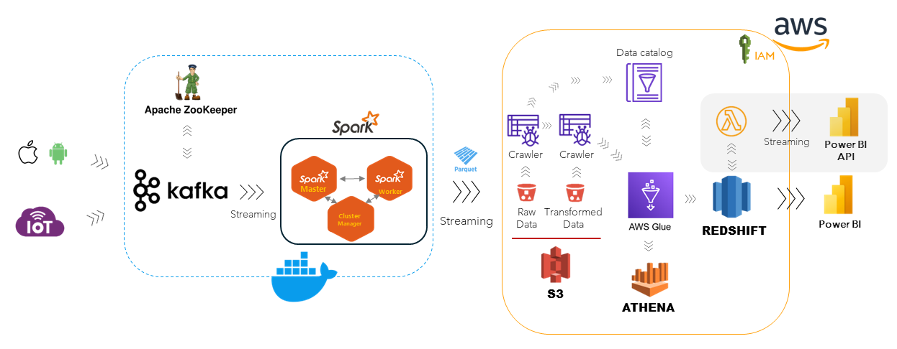
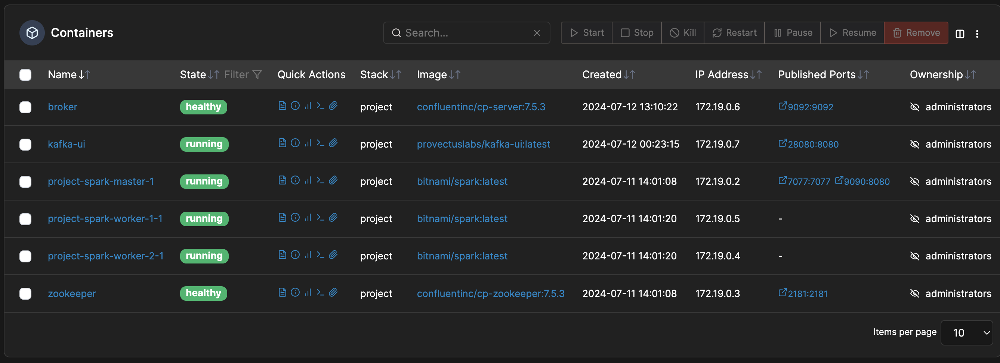
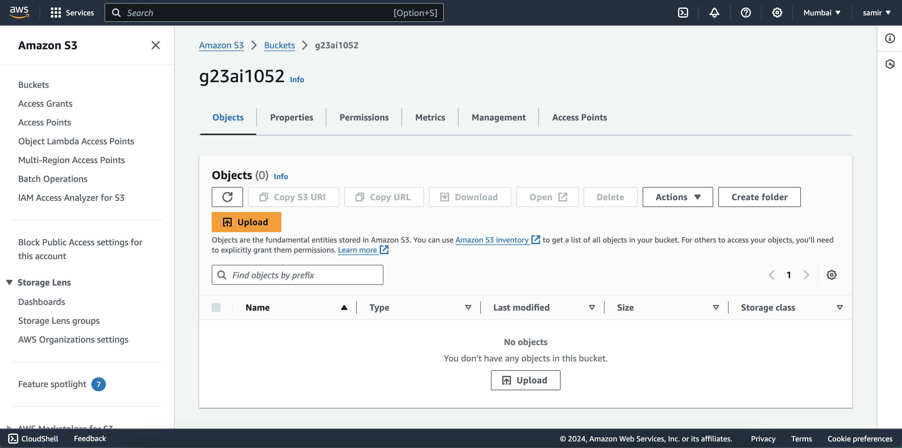

# Smart City Data Engineering Platform

## Overview
This project demonstrates the design and setup of a data engineering platform for analyzing streaming data from IoT devices in a smart city. The platform integrates various components for data ingestion, storage, processing, aggregation, and visualization to provide real-time insights and facilitate data-driven decision-making.

## Architecture Overview

## Components

### Data Ingestion
- **Kafka:** Utilized for streaming data ingestion from various smart city sources such as weather sensors, IoT devices, mobile devices (iOS and Android), and GPS data.
- **Apache ZooKeeper:** Provides distributed coordination and management for Kafka clusters.

### Data Storage
- **Amazon S3:** Stores both raw and processed data in a scalable and durable manner, supporting various formats including Parquet for optimized analytics.
- **Amazon Redshift:** Data warehousing solution used to store and query structured data, enabling complex analytics and reporting.

### Data Processing
- **Apache Spark:** Processes streaming and batch data in real-time, performing complex transformations and computations to derive actionable insights.
- **AWS Glue:** ETL (Extract, Transform, Load) service for preparing, cleaning, and transforming data to make it analytics-ready.

### Data Aggregation
- **AWS Glue:** Also performs data aggregation during the ETL process, organizing and summarizing data for efficient querying.
- **Amazon Athena:** Enables SQL querying of data stored in Amazon S3, facilitating on-the-fly aggregation and analysis without the need for a dedicated server.

### Data Visualization
- **Power BI:** Creates interactive reports and dashboards to visualize aggregated data, providing stakeholders with real-time insights into the city's operations.
- **Power BI API:** Streams data directly to Power BI for real-time visualization, ensuring that the latest data is always available for decision-making.

## Data Flow Description

1. **Data Ingestion:**
   - Data from various sources such as weather sensors, IoT devices, mobile devices, and GPS data are ingested into Kafka, coordinated by Apache ZooKeeper.
   
2. **Data Processing:**
   - Kafka streams the data to Apache Spark for real-time processing and batch computations. The processed data is then stored in Parquet format for efficient querying.
   
3. **Data Storage:**
   - The processed data is saved to Amazon S3 in both raw and transformed states, ensuring that historical data is preserved and readily accessible.
   
4. **Data Aggregation:**
   - AWS Glue crawlers catalog the raw and transformed data, preparing it for aggregation and analysis using Amazon Athena.
   
5. **Data Storage and Aggregation:**
   - The aggregated data is stored in Amazon Redshift, where it can be queried for more complex analytics and reporting.
   
6. **Data Visualization:**
   - Data from Amazon Redshift is streamed to Power BI via AWS Lambda for real-time visualization, or accessed directly by Power BI to create dashboards and reports.

## Prerequisites

- AWS account with necessary permissions for using S3, Redshift, Glue, Athena, and Lambda.
- Kafka and Apache ZooKeeper setup.
- Power BI account for data visualization.

## Setup

### Kafka and Apache ZooKeeper
1. Install and configure Kafka and Apache ZooKeeper.
2. Create Kafka topics for data ingestion from various smart city sources.

#### Docker Setup
1. Set the `HOST_IP` environment variable with your machine's IP address:
   `export HOST_IP=123.456.456.123`  # Replace with your actual IP address
2. Start the Docker services:
   `docker-compose up -d`
3. Verify that all services are running:
   `docker-compose ps`

4. Use test_kafkaConsumer.py and test_kafkaProducer.py to test the Kafka functionality.

### AWS Services
1. Configure AWS S3 buckets for storing raw and processed data.
2. Set up AWS Glue crawlers and jobs for ETL processes.
3. Create an Amazon Redshift cluster for data warehousing.
4. Configure Amazon Athena for querying data in S3.
5. Set up AWS Lambda functions for streaming data to Power BI.

#### Create S3 Buckets
1. Create S3 buckets for raw and processed data.

#### Create Glue Crawler
1. Create a Glue crawler to ingest data from various smart city sources.

#### Create Glue Job
1. Create a Glue job to transform and aggregate data from Kafka to Parquet format.

#### Create Redshift Cluster
1. Create an Amazon Redshift cluster for data warehousing.

#### Create Athena Database
1. Create an Athena database for storing aggregated data.

#### Create Athena Table
1. Create an Athena table for storing aggregated data.

#### Create Lambda Function
1. Create an AWS Lambda function for streaming data to Power BI.

#### Create Power BI Workspace
1. Create a Power BI workspace.

### Power BI
1. Create a Power BI workspace.
2. Set up data sources to connect with Amazon Redshift.
3. Build interactive reports and dashboards.

## Usage

1. Start Kafka and Apache ZooKeeper.
2. Ingest data from various smart city sources into Kafka.
3. Process the ingested data using Apache Spark.
4. Store the processed data in Amazon S3.
5. Use AWS Glue to catalog and transform data.
6. Query and aggregate data using Amazon Athena.
7. Stream data to Power BI for real-time visualization or directly connect Power BI to Amazon Redshift for reporting.

## Conclusion

This platform ensures efficient handling of real-time data ingestion, processing, storage, aggregation, and visualization, enabling smart city administrators to make informed decisions based on up-to-date insights.

## License

This project is licensed under the MIT License - see the [LICENSE](LICENSE) file for details.

## Acknowledgments

- [Apache Kafka](https://kafka.apache.org/)
- [Apache Spark](https://spark.apache.org/)
- [AWS](https://aws.amazon.com/)
- [Power BI](https://powerbi.microsoft.com/)

## License
This project is licensed under the MIT License - see the LICENSE file for details.
