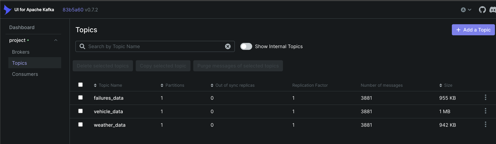
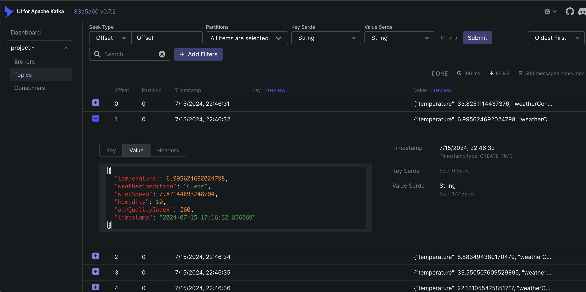
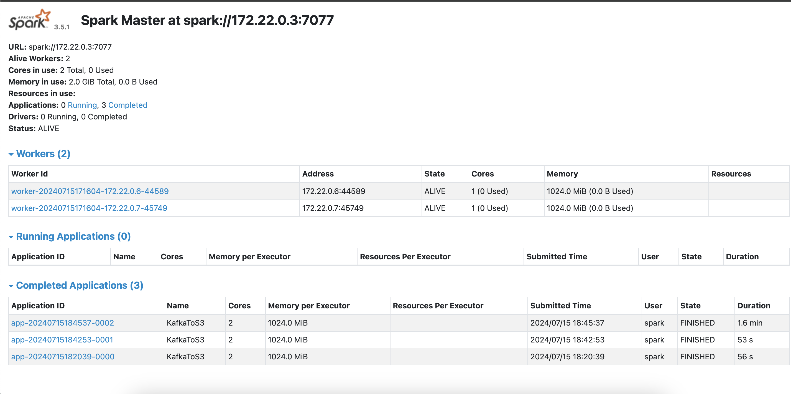
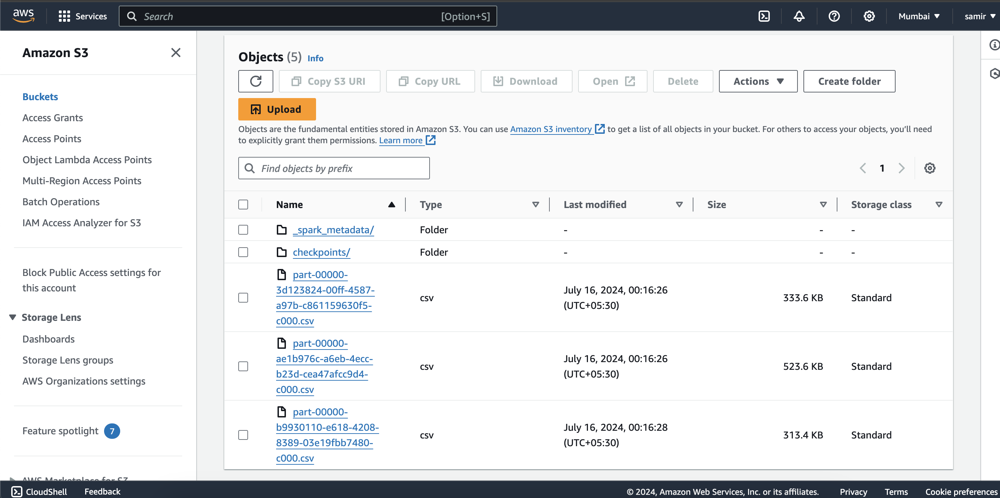
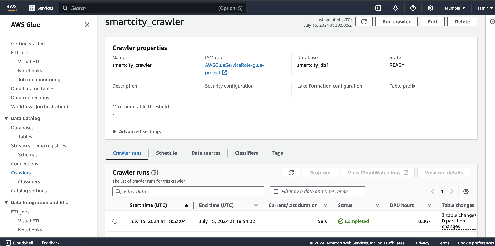
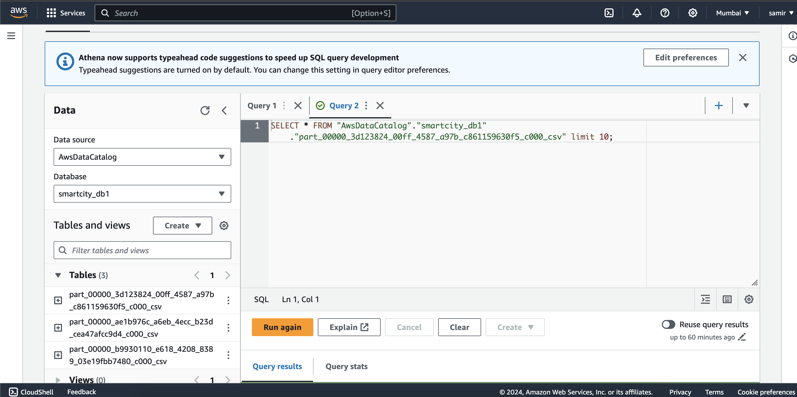

# Smart City Data Engineering Platform

## Overview
This project demonstrates the design and setup of a data engineering platform for analyzing streaming data from IoT devices in a smart city. The platform integrates various components for data ingestion, storage, processing, aggregation, and visualization to provide real-time insights and facilitate data-driven decision-making.

## Architecture Overview


## Data Ingress and Processing
1. Use the `simulate.py` script to simulate data ingestion.

   
   

2. Copy the `aws.json`, `kafka.json`, `spark.json`, and `spark_job.py` files to the `project-spark-master-1` container.

   ```
   docker cp aws.json project-spark-master-1:/opt/bitnami/spark/aws.json

   docker cp kafka.json project-spark-master-1:/opt/bitnami/spark/kafka.json

   docker cp spark.json project-spark-master-1:/opt/bitnami/spark/spark.json

   docker cp spark_job.py project-spark-master-1:/opt/bitnami/spark/spark_job.py
   ```

3. Run the `spark_job.py` script in the `project-spark-master-1` container.
   ```
   docker exec -it project-spark-master-1 spark-submit --packages org.apache.hadoop:hadoop-aws:3.3.1,org.apache.spark:spark-sql-kafka-0-10_2.12:3.5.1 spark_job.py
   ```
   

4. Verify data at S3 buckets.


5. Create AWS Glue crawlers and jobs for ETL processes.


6. Run AWS Athena queries.


## Acknowledgments

- [Apache Kafka](https://kafka.apache.org/)
- [Apache Spark](https://spark.apache.org/)
- [AWS](https://aws.amazon.com/)

## License
This project is licensed under the MIT License - see the LICENSE file for details.
