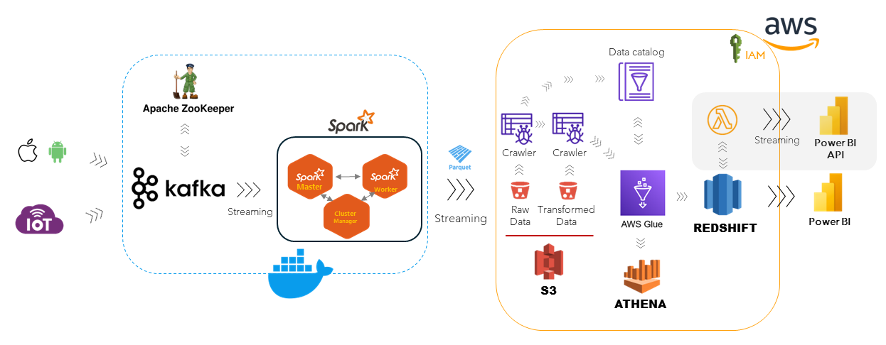
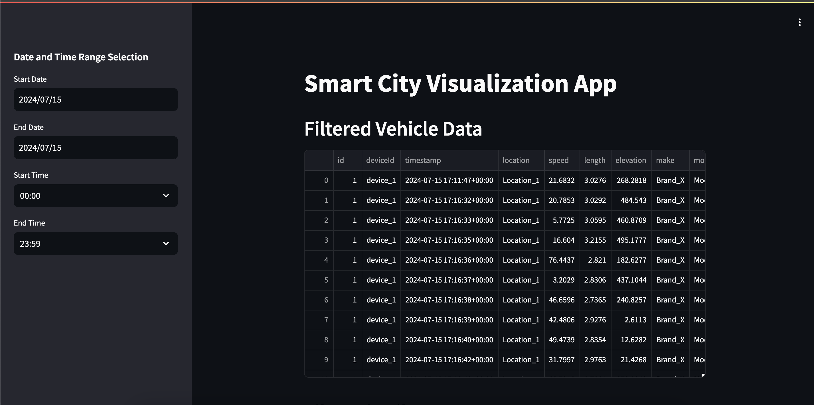

# Smart City Data Engineering Platform

## Overview
This project demonstrates the design and setup of a data engineering platform for analyzing streaming data from IoT devices in a smart city. The platform integrates various components for data ingestion, storage, processing, aggregation, and visualization to provide real-time insights and facilitate data-driven decision-making.

## Architecture Overview



## Data Aggregation and Visualization
1. Create a streamlit app to display the aggregated data.

2. Create a Docker container to run the streamlit app. The Dockerfile can be found in the `docker_builder` folder.
   ```
   # Use an official Python runtime as a parent image
   FROM python:3.10-slim

   # Set the working directory in the container
   WORKDIR /app

   # Copy the current directory contents into the container at /app
   COPY . /app

   # Install any needed packages specified in requirements.txt
   RUN pip3 install --no-cache-dir -r /app/requirements.txt

   # Expose the port that Streamlit runs on
   EXPOSE 8501

   HEALTHCHECK CMD curl --fail http://localhost:8501/_stcore/health

   # Command to run the Streamlit app
   CMD ["streamlit", "run", "Smartcity.py", "--server.port=8501", "--server.address=0.0.0.0"]

   ```
3. Build the Docker image

   ```
   docker build -t smartcity .
   ```

4. Run the Docker container
   ```
   docker run -p 8501:8501 --name smartcity smartcity
   ```
   

## Acknowledgments

- [Apache Kafka](https://kafka.apache.org/)
- [Apache Spark](https://spark.apache.org/)
- [AWS](https://aws.amazon.com/)

## License
This project is licensed under the MIT License - see the LICENSE file for details.
