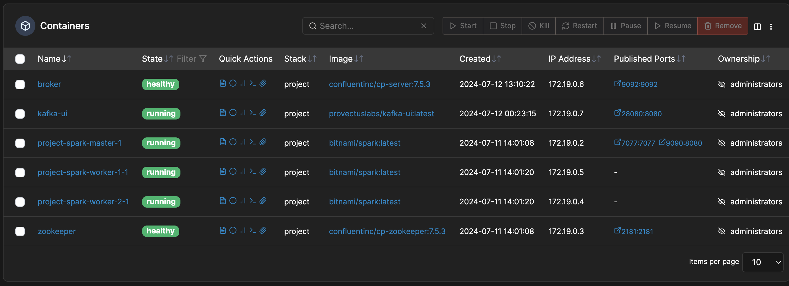
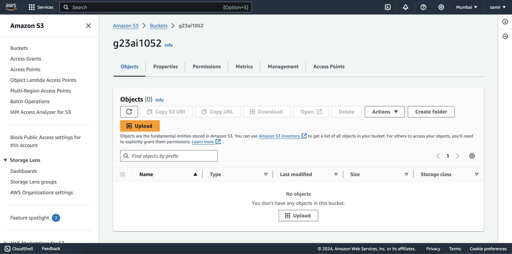
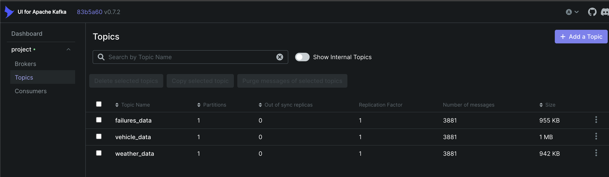
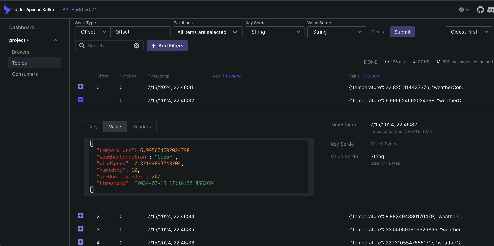
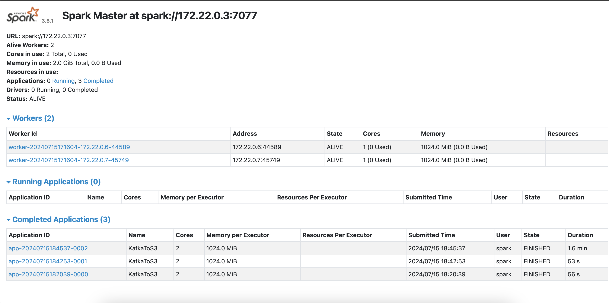
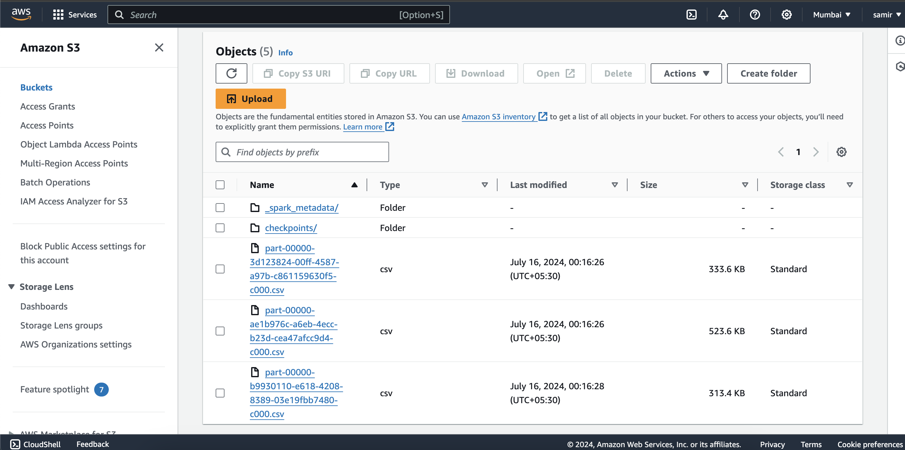
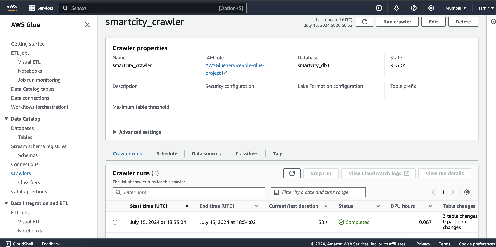
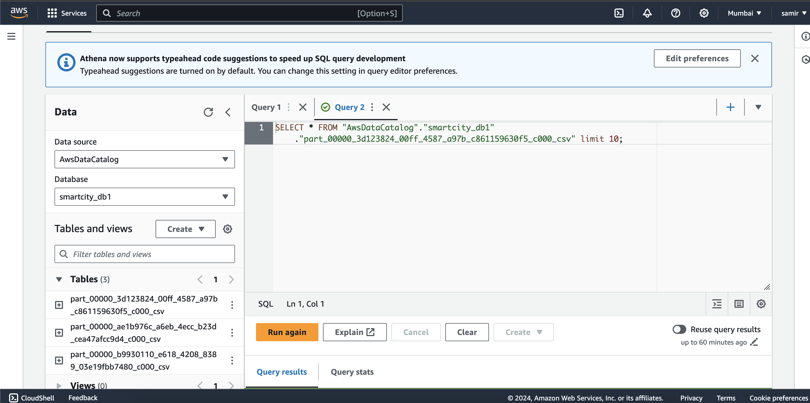
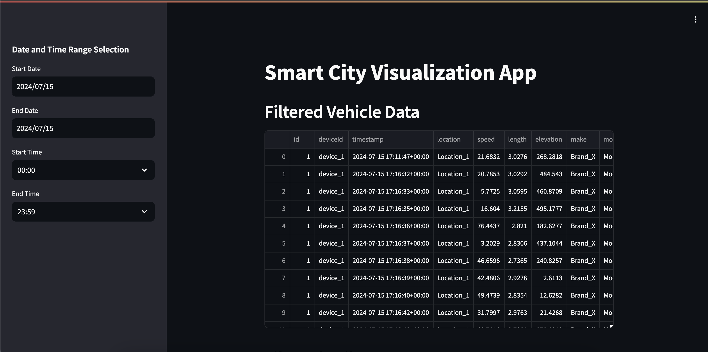

# Smart City Data Engineering Platform

## Overview
This project demonstrates the design and setup of a data engineering platform for analyzing streaming data from IoT devices in a smart city. The platform integrates various components for data ingestion, storage, processing, aggregation, and visualization to provide real-time insights and facilitate data-driven decision-making.

## Architecture Design


### Components

#### Data Ingestion
- **Kafka:** Utilized for streaming data ingestion from various smart city sources such as weather sensors, IoT devices, mobile devices (iOS and Android), and GPS data.
- **Apache ZooKeeper:** Provides distributed coordination and management for Kafka clusters.

#### Data Storage
- **Amazon S3:** Stores both raw and processed data in a scalable and durable manner, supporting various formats including Parquet for optimized analytics.
- **Amazon Redshift:** Data warehousing solution used to store and query structured data, enabling complex analytics and reporting.

#### Data Processing
- **Apache Spark:** Processes streaming and batch data in real-time, performing complex transformations and computations to derive actionable insights.
- **AWS Glue:** ETL (Extract, Transform, Load) service for preparing, cleaning, and transforming data to make it analytics-ready.

#### Data Aggregation
- **AWS Glue:** Also performs data aggregation during the ETL process, organizing and summarizing data for efficient querying.
- **Amazon Athena:** Enables SQL querying of data stored in Amazon S3, facilitating on-the-fly aggregation and analysis without the need for a dedicated server.

#### Data Visualization
- **Power BI:** Creates interactive reports and dashboards to visualize aggregated data, providing stakeholders with real-time insights into the city's operations.
- **Power BI API:** Streams data directly to Power BI for real-time visualization, ensuring that the latest data is always available for decision-making.
- **Streamlit:** Easy data visualization tool.

### Data Flow Description

1. **Data Ingestion:**
   - Data from various sources such as weather sensors, IoT devices, mobile devices, and GPS data are ingested into Kafka, coordinated by Apache ZooKeeper.
   
2. **Data Processing:**
   - Kafka streams the data to Apache Spark for real-time processing and batch computations. The processed data is then stored in Parquet format for efficient querying.
   
3. **Data Storage:**
   - The processed data is saved to Amazon S3 in both raw and transformed states, ensuring that historical data is preserved and readily accessible.
   
4. **Data Aggregation:**
   - AWS Glue crawlers catalog the raw and transformed data, preparing it for aggregation and analysis using Amazon Athena.
   
5. **Data Storage and Aggregation:**
   - The aggregated data is stored in Amazon Redshift, where it can be queried for more complex analytics and reporting.
   
6. **Data Visualization:**
   - Data from Amazon Redshift is streamed to Power BI via AWS Lambda for real-time visualization, or accessed directly by Power BI to create dashboards and reports.

### Prerequisites

- AWS account with necessary permissions for using S3, Redshift, Glue, Athena, and Lambda.
- Kafka and Apache ZooKeeper setup.

## Setup

### Kafka and Apache ZooKeeper
1. Install and configure Kafka and Apache ZooKeeper.
2. Create Kafka topics for data ingestion from various smart city sources.

#### Docker Setup
1. Set the `HOST_IP` environment variable with your machine's IP address:
   ```
   export HOST_IP=123.456.456.123  # Replace with your actual IP address
   ```
2. Start the Docker services:
   ```
   docker-compose up -d
   ```
3. Verify that all services are running:
   ```
   docker-compose ps
   ```
   
4. Use test_kafkaConsumer.py and test_kafkaProducer.py to test the Kafka functionality.

### AWS Services
1. Configure AWS S3 buckets for storing raw and processed data.
2. Set up AWS Glue crawlers and jobs for ETL processes.
3. Create an Amazon Redshift cluster for data warehousing.
4. Configure Amazon Athena for querying data in S3.
5. Set up AWS Lambda functions for streaming data to Power BI.

#### Create S3 Buckets
1. Create S3 buckets for raw and processed data.


## Data Ingress and Processing
1. Use the `simulate.py` script to simulate data ingestion.

   
   

2. Copy the `aws.json`, `kafka.json`, `spark.json`, and `spark_job.py` files to the `project-spark-master-1` container.

   ```
   docker cp aws.json project-spark-master-1:/opt/bitnami/spark/aws.json

   docker cp kafka.json project-spark-master-1:/opt/bitnami/spark/kafka.json

   docker cp spark.json project-spark-master-1:/opt/bitnami/spark/spark.json

   docker cp spark_job.py project-spark-master-1:/opt/bitnami/spark/spark_job.py
   ```

3. Run the `spark_job.py` script in the `project-spark-master-1` container.
   ```
   docker exec -it project-spark-master-1 spark-submit --packages org.apache.hadoop:hadoop-aws:3.3.1,org.apache.spark:spark-sql-kafka-0-10_2.12:3.5.1 spark_job.py
   ```
   

4. Verify data at S3 buckets.


5. Create AWS Glue crawlers and jobs for ETL processes.


6. Run AWS Athena queries.


## Data Aggregation and Visualization
1. Create a streamlit app to display the aggregated data.

2. Create a Docker container to run the streamlit app. The Dockerfile can be found in the `docker_builder` folder.
   ```
   # Use an official Python runtime as a parent image
   FROM python:3.10-slim

   # Set the working directory in the container
   WORKDIR /app

   # Copy the current directory contents into the container at /app
   COPY . /app

   # Install any needed packages specified in requirements.txt
   RUN pip3 install --no-cache-dir -r /app/requirements.txt

   # Expose the port that Streamlit runs on
   EXPOSE 8501

   HEALTHCHECK CMD curl --fail http://localhost:8501/_stcore/health

   # Command to run the Streamlit app
   CMD ["streamlit", "run", "Smartcity.py", "--server.port=8501", "--server.address=0.0.0.0"]

   ```
3. Build the Docker image

   ```
   docker build -t smartcity .
   ```

4. Run the Docker container
   ```
   docker run -p 8501:8501 --name smartcity smartcity
   ```
   

## Data Retention Policies and Lifecycle Management:

Create S3 Bucket:

- Go to the S3 service in the AWS Management Console.
- Create a new bucket or select an existing one where you want to apply the lifecycle policy.

Configure Lifecycle Policy:

- Navigate to the "Management" tab of your bucket.
- Click "Create lifecycle rule."
- Name your rule and set the scope (apply to the whole bucket or specific prefixes/tags).
- Define the transitions:
  - For example, move objects to S3 Standard-IA (Infrequent Access) after 30 days.
  - Move objects to S3 Glacier after 90 days.
- Define expiration:
  - Permanently delete objects after 365 days.
- Review and save the lifecycle rule.

## Applying Security Best Practices
1. Enable Encryption at Rest:

   Enable server-side encryption with Amazon S3-managed keys (SSE-S3) or AWS Key Management Service (SSE-KMS) when uploading objects to S3.
   ```
   import boto3

   s3 = boto3.client('s3')
   s3.put_object(
      Bucket='my-bucket',
      Key='my-object-key',
      Body='my-data',
      ServerSideEncryption='AES256'  # For SSE-S3
   )
   ```
2. Enable Encryption in Transit:

   Use HTTPS to ensure encryption in transit when accessing S3.
   Ensure your application uses HTTPS endpoints.
3. Set Up Proper Access Controls:

   - Bucket Policies:

      Define bucket policies to grant/restrict access.
      ```
      {
         "Version": "2012-10-17",
         "Statement": [
            {
                  "Sid": "Stmt1",
                  "Effect": "Allow",
                  "Principal": {
                     "AWS": "arn:aws:iam::account-id:root"
                  },
                  "Action": "s3:*",
                  "Resource": [
                     "arn:aws:s3:::my-bucket",
                     "arn:aws:s3:::my-bucket/*"
                  ]
            }
         ]
      }
      ```
   - IAM Policies:

      Define fine-grained permissions for IAM users and roles.
      ```
      {
         "Version": "2012-10-17",
         "Statement": [
            {
                  "Effect": "Allow",
                  "Action": "s3:ListBucket",
                  "Resource": "arn:aws:s3:::my-bucket"
            },
            {
                  "Effect": "Allow",
                  "Action": [
                     "s3:GetObject",
                     "s3:PutObject"
                  ],
                  "Resource": "arn:aws:s3:::my-bucket/*"
            }
         ]
      }
      ```
4. Use AWS IAM for Authentication and Authorization:

      Create IAM Roles:

      Create IAM roles for EC2, Lambda, and other AWS services that require access to S3.
      Attach relevant policies to these roles.
      Enable MFA:

      Enable Multi-Factor Authentication (MFA) for your AWS account and IAM users.

## Optimizing the Platform for Cost
1. Use Cost-Effective Storage Options:

   S3 Storage Classes:
   Use different storage classes based on access patterns:
   S3 Standard for frequently accessed data.
   S3 Standard-IA for infrequently accessed data.
   S3 Glacier for archival data.
2. Set Up S3 Lifecycle Policies:

   As detailed above, configure lifecycle policies to move data between storage classes and delete old data.
3. Monitor and Optimize Resource Utilization:

   AWS Cost Explorer:

   Use AWS Cost Explorer to monitor usage and costs.
   Identify unused resources and remove or downsize them.
   AWS Trusted Advisor:

   Use Trusted Advisor to get recommendations on cost optimization, including underutilized instances and unattached EBS volumes.
   Right-Sizing:

   Regularly review and adjust the size of your EC2 instances and other resources to match your current workload requirements.
   Implementation Example
   Setting Up Lifecycle Policies:
   ```
   import boto3

   s3 = boto3.client('s3')
   s3.put_bucket_lifecycle_configuration(
      Bucket='my-bucket',
      LifecycleConfiguration={
         'Rules': [
               {
                  'ID': 'Move to Glacier',
                  'Filter': {'Prefix': ''},
                  'Status': 'Enabled',
                  'Transitions': [
                     {
                           'Days': 30,
                           'StorageClass': 'STANDARD_IA'
                     },
                     {
                           'Days': 90,
                           'StorageClass': 'GLACIER'
                     }
                  ],
                  'Expiration': {
                     'Days': 365
                  }
               }
         ]
      }
   )
   ```
   Enabling Server-Side Encryption:
   ```
   s3.put_object(
      Bucket='my-bucket',
      Key='my-object-key',
      Body='my-data',
      ServerSideEncryption='AES256'  # SSE-S3
   )
   ```
   Setting IAM Policies for S3 Access:
   ```
   {
      "Version": "2012-10-17",
      "Statement": [
         {
               "Effect": "Allow",
               "Action": "s3:ListBucket",
               "Resource": "arn:aws:s3:::my-bucket"
         },
         {
               "Effect": "Allow",
               "Action": [
                  "s3:GetObject",
                  "s3:PutObject"
               ],
               "Resource": "arn:aws:s3:::my-bucket/*"
         }
      ]
   }
   ```

## Acknowledgments

- [Apache Kafka](https://kafka.apache.org/)
- [Apache Spark](https://spark.apache.org/)
- [AWS](https://aws.amazon.com/)

## License
This project is licensed under the MIT License - see the LICENSE file for details.
